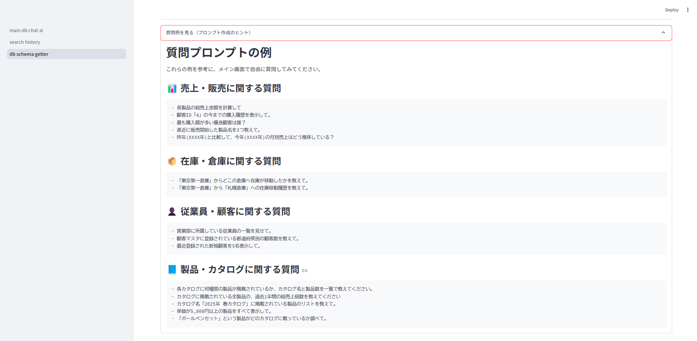
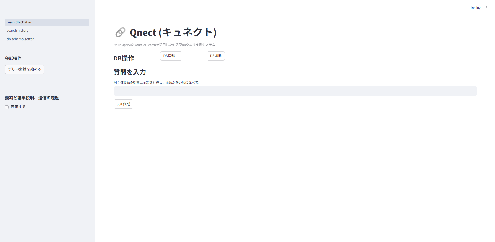

# Qnect (キュネクト) - 対話型DBクエリ支援システム

**Qnect** は、Azureクラウド技術と生成AIを活用し、自然言語でのデータベース操作を可能にするチャットシステムです。専門知識がなくても、誰でも直感的にビジネスデータにアクセスし、迅速な意思決定を支援します。

## ✨ 主な機能

- 自然言語からのクエリ生成・実行(SQL自動生成)
- クエリ結果の要約・分析
- データアクセス・変更を防ぐためのセキュリティ機能
- 会話レスポンス内の機密情報のマスキング
- 対話履歴を基にした文脈保持
- ユーザーによるクエリ修正指示への柔軟な対応
- DBからDBスキーマ(テーブル構造)を取得してAzure OpenAIに提示可能
- 埋込用ベクトル生成＋類似検索(Azure OpenAI Embedding + Azure AI Search ベクトルインデックス)
- キーワード検索(完全一致)(Azure Cosmos DB)
- Azure OpenAIへの1回あたりの送信Token数と受信Token数を制御

## 🚀 技術スタック
- Azure OpenAI (Chat用モデル)[gpt-4o または gpt-4o miniなど]
- Azure SQL Database (構造化データ)
- Python
- Streamlit (UI)
- Azure OpenAI (Embedding用モデル)[text-embedding-ada-002 または text-embedding-3-smallなど]
- Azure AI Search (類似質問検索)
- Azure Cosmos DB (会話履歴)
- Azure App Service

## 📂 フォルダ構成

フォルダ構成は `directory_structure.txt` を参照してください。

## 🛠️ セットアップに関する設定、ローカル環境での実行手順、および、Azure App Serviceへのデプロイ手順

詳細な手順は `doc/setup_guide.md` を参照してください。

## 📖 使い方

システムを開いたら、メイン画面で 「DB接続！」ボタン を押し、データベースへ接続してください。

チャット入力欄に質問を日本語で入力してください。AIが応答し、必要に応じてデータベースから情報を取得し要約します。
通常のUI側でSQL作成とSQLを実行し「要約と結果の説明」ボタンを押すと、チャットUIが表示され、対話型のチャットを開始できます。
新しい会話を始めたい場合は、左のサイドバーで「新しい会話を始める」ボタンをクリックしてください。

DBスキーマ管理画面の下部の"質問例を見る（プロンプト作成のヒント）"を押すと、質問例が表示されます。質問作成の参考としてご活用ください。

## 🖼️ システム画面イメージ

### 質問例の画面

### メイン画面

